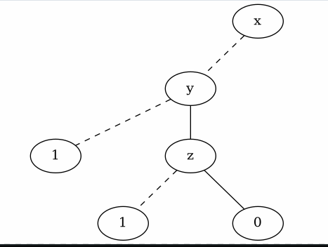
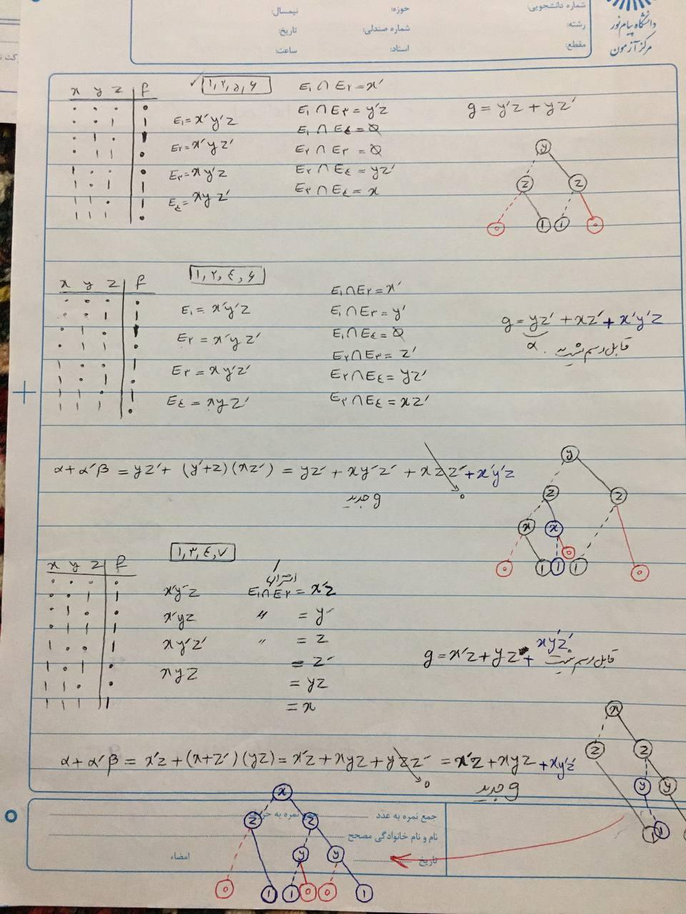

# Binary Tree Python

A software to analyze a octal number and generate formula to produce graph. (Phd Project in mathematics field, Article)

I'm supervisor of this software to help in this research. (It will publish as article)

> Old version of this software available at [Binary Tree Diagram](https://github.com/BaseMax/BinaryTreeDiagram).

## Using

```
$ python source.py
0 1 2 or any other input
```

Output:



## Examples





## Related Repositories

- https://github.com/BaseMax/BinaryTreeDiagram
- https://github.com/BaseMax/BinaryTreeDiagramDrawing

© Copyright Max Base, 2021
